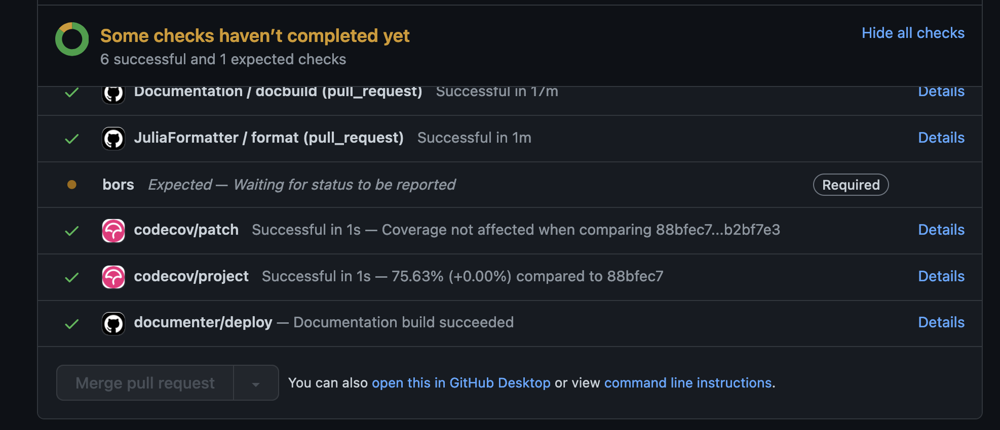

# Introduction to version control with `git`

Version control Software (VCS) is also referred as SCM (Source Code Management) or RCS (Revision Control System) tools. Version control, also known as source control, is the practice of tracking and managing changes to source files. Version control systems are software tools that help teams of contributors manage changes to source code over time. There are several options: `git`, `CVS`, `SVN`, etc.

For this workshop, we will focus on [`git`](https://git-scm.com/docs) in particular.

> "`git init` is only 3 characters longer than `mkdir`", Jed Brown, Asst. Prof., CU Boulder

Some of the material presented in this overview is largely re-adapted from ClimateMachine.jl's [contributing guide](https://clima.github.io/ClimateMachine.jl/latest/Contributing/#Contributing).


If you are unfamiliar with `git` and version control, the following guides can be helpful:

- [Atlassian (bitbucket) git tutorials](https://www.atlassian.com/git/tutorials). A set of tips and tricks for getting started with `git`.
- [GitHub's git tutorials](https://try.github.io/). A set of resources from  GitHub to learn `git`.

We provide a brief guide here.

## Identity

First make sure `git` knows your name and email address:

```
$ git config --global user.name "A. Climate Developer"
$ git config --global user.email "a.climate.developer@eg.com"
```

## Forks and branches

Create your own fork of the desired repository and check out your copy. For example:

```
$ git clone https://github.com/<username>/ClimaCore.jl.git
$ cd ClimateMachine.jl
$ git remote add upstream https://github.com/CliMA/ClimaCore.jl
```

What is the difference between using the `https` or the `ssh` protocol? If you use `https` the primary downside for most people is that you must enter your Git password/token every time you push. While it gets added to a cache, it’s not configured to cache permanently (though this can be changed). With SSH keys, it just uses the key file on disk every time so you don't have to enter your Git password/token at every push. Check this guide to [generate SSH keys and add them to the ssh-agent](https://docs.github.com/en/authentication/connecting-to-github-with-ssh/generating-a-new-ssh-key-and-adding-it-to-the-ssh-agent).

Now you have two remote repositories: `origin`, which is your fork (hosted on your cloud account), and `upstream`, which is the main `ClimateCore.jl` repository.

When part of an organization, people who contribute to an open-source project do not generally fork the repository, but `clone` it directly on their local machine. If you are not sure about the differences [between forking and cloning](https://www.toolsqa.com/git/difference-between-git-clone-and-git-fork/#:~:text=When%20you%20fork%20a%20repository,with%20the%20help%20of%20Git.), check this helpful article.

Create a branch for your feature; this will hold your contribution:

```
$ git checkout -b <branchname>
```

### Some useful tips
- When you start working on a new feature branch, make sure you start from master by running: `git checkout main`.
- When you create a new branch and check it out, as in `git checkout -b <branchname>`, a common convention is to make `branchname` something along the lines of `<yourname>/<affected-module>-<short-description>`.

## Develop your feature

Follow the recommended [Coding conventions](https://clima.github.io/ClimateMachine.jl/latest/DevDocs/CodeStyle/#Coding-conventions), especially remember that readability and accessibility are very important aspects to make a codebase inclusive. For instance,  `snake_case` or `CamelCase` are more accessible than `nocase` for people who have vision problems.

If you recognize the need for a feature that you and others may use in your work, please consider contributing this feature yourself. First by opening an issue, if one associated to this feature is not already open.

Then, when adding your contribution, please make sure you add appropriate unit tests for your code in `test/` and appropriate documentation in the code and/or in `docs/`.

### Some useful tips

- Once you have written some code, inspect changes by running `git status`.
- Commit all files changed: `git commit -a` or
- Commit selected files: `git commit <file1> <file2>` or
- Add new files to be committed: `git add <file1> <file2>` (or more briefly,
`git add -u` to stage all updated files at once) followed by `git commit`.
  Modified files can be added to a commit in the same way.
- Push feature branch to the remote for review: `git push origin <branchname>`
- Use descriptive, useful commit messages, and don't swear if you don't want your commit message to be shared publicly by the [@gitlost Twitter bot](https://twitter.com/gitlost?lang=en)!

## Squash and rebase

Only _after_ a reviewer is done with their review and your PR is approved, it is good to squash your commits history before merging the PR. Use `git rebase` (not `git merge` so you don't bring all commits history in) to sync your work:

```
$ git fetch upstream
$ git rebase upstream/main
```

You might find it easier to [squash your commits](https://github.com/edx/edx-platform/wiki/How-to-Rebase-a-Pull-Request#squash-your-changes) first.

### Some useful tips

When cleaning up your local branches, some of the following commands might be useful:
- Show local and remote-tracking branches: `git branch -a`.
- Show available remotes: `git remote -v`.
- Show all branches available on remote: `git ls-remote`.
Use `git remote show origin` for a complete summary.
- Delete a local branch: `git branch -D <branchname>` (only after merge to
  `master` is complete).
- Delete remote branch: `git push origin :<branchname>` (mind the colon in
  front of the branch name).

Additionally, when debugging or inspecting the code for some potentially problematic changes introduced, some of the following commands can be used:
- Show logs: `git log`. (A more powerful version of this that can track all
  changes, even after potential rebases, is [`git reflog`](https://git-scm.com/docs/git-reflog)).
- Show logs for file or folder: `git log <file>`.
- Show changes for each log: `git log -p` (add file or folder name if required).
- Show diff with current working tree: `git diff path/to/file`.
- Show diff with other commit: `git diff <SHA1> path/to/file`.
- Compare version of file in two commits: `git diff <SHA1> <SHA1> path/to/file`.
- Show changes that are in `master`, but not yet in my current branch:
  `git log..master`.
- Discard changes to a file which are not yet committed: `git checkout <file>`.
  (If the file was aready staged via `git add <file>`, then use `git restore <file>`
  first, and then `git checkout <file>` to discard local changes).
- Discard all changes to the current working tree: `git checkout -f`.

## Code reviews

Code reviews are possibly the most under-rated service in open-source/community projects. The best way to get familiar with a code base is reviewing other contributors' code. Unless the PR is only touching on some documentation (for which you can inspect the preview on GitHub—see the `documenter/deploy` action in the image below), you want to checkout the branch associated with the PR and test/run the code. If output is expected, inspect it. If some things are not clear, perhaps more documentation is needed, hence, you can ask contributors to improve it.



